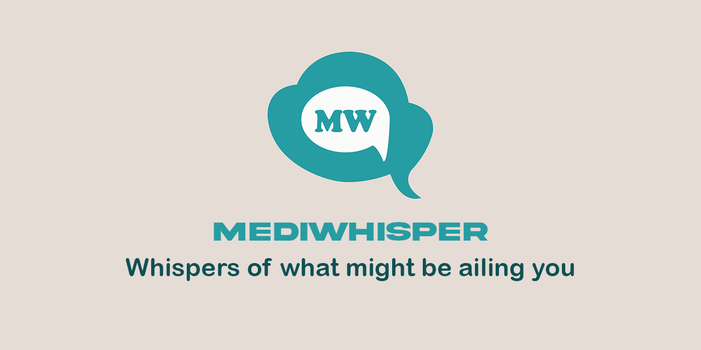

<div align="center">

</div>

---

This Project is a group work for the course CSM 395 - Introduction to Artificial Intelligence at KNUST. It uses Next.js for the frontend and Node.js for the backend.

## Getting Started

First, **Clone the repository:**

```bash
git clone https://github.com/Llewellyn500/mediwhisper.git
```

**Run the install script:**

```bash
npm install
# or
yarn install
# or
bun install
```

**Run the development server:**

```bash
npm run dev
# or
yarn dev
# or
bun dev
```

open a new terminal instance and 
**Run the Backend server:**

```bash
npm run backend
# or
yarn backend
# or
bun backend
```

Open [http://localhost:3000](http://localhost:3000) with your browser to see the result.

You can start editing the page by modifying `app/page.tsx`. The page auto-updates as you edit the file.

This project uses [`next/font`](https://nextjs.org/docs/basic-features/font-optimization) to automatically optimize and load Inter, a custom Google Font.

## Folder Structure

```
.
├── app
│   ├── components (directory)
│   │   └── form
│   │       └── Form.tsx
│   ├── globals.css
│   ├── layout.tsx
│   └── page.tsx
├── node_modules (directory)
├── public (directory)
│   ├── psd (directory) 
│   │   ├── mediwhisoer-logo.psd
│   │   └── open-graph.psd
│   ├── android-icon-36x36.png
│   ├── android-icon-48x48.png
│   ├── android-icon-72x72.png
│   ├── android-icon-96x96.png
│   ├── android-icon-144x144.png
│   ├── android-icon-192x192.png
│   ├── apple-icon-57x57.png
│   ├── apple-icon-60x60.png
│   ├── apple-icon-72x72.png
│   ├── apple-icon-76x76.png
│   ├── apple-icon-114x114.png
│   ├── apple-icon-120x120.png
│   ├── apple-icon-144x144.png
│   ├── apple-icon-152x152.png
│   ├── apple-icon-180x180.png
│   ├── apple-icon-precomposed.png
│   ├── apple-icon.png
│   ├── browserconfig.xml
│   ├── favicon-16x16.png
│   ├── favicon-32x32.png
│   ├── favicon-96x96.png
│   ├── favicon.ico
│   ├── logo-trans.png
│   ├── logo.png
│   ├── manifest.json
│   ├── ms-icon-70x70.png
│   ├── ms-icon-144x144.png
│   ├── ms-icon-150x150.png
│   ├── ms-icon-310x310.png
│   └── open-graph.png
├── .gitignore
├── bun.lockb
├── server.js
└── TS next-env.d.ts
```
